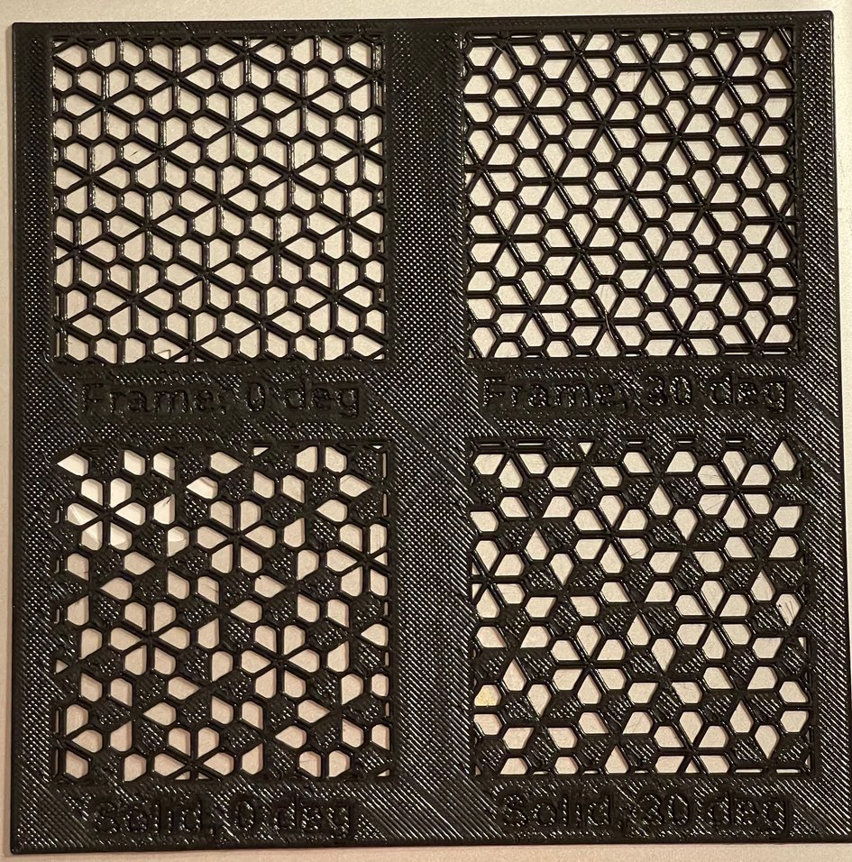

# floret-tiling

Implement floret pentagonal (6-fold pentille) tiling, either as a pure frame pattern, or as a partially filled pattern.

## API

* `floret_tile_frame(side=10, thickness=thickness, angle_off=0, width=200, height=200)`  
Generate a wireframe pattern.  

 * `side`: Length of short side of pentagons.
 * `thickness`: Thickness and width of wires.
 * `angle_off`: Additional rotation to apply to pentiles. Leaving this at `0` or omitting is likely to give best results when printing in a vertical orientation.
 * `width`, `height`: Dimensions of pattern in the XY plane. The lower left corner is always at `(0, 0, 0)`.

* `floret_tile_solid(side=10, thickness=thickness, angle_off=0, width=200, height=200)`  
  Generate a partially filled pattern. Parameters are identical to `floret_tile_frame`. `angle_off=60` will give a different fill pattern with pentiles in same orientation.

See the demo project at the end of the library for some example patterns.

## Notes

Initial CGAL rendering of large patterns can take several minutes, but it will eventually terminate, and subsequent re-renderings are often much quicker.